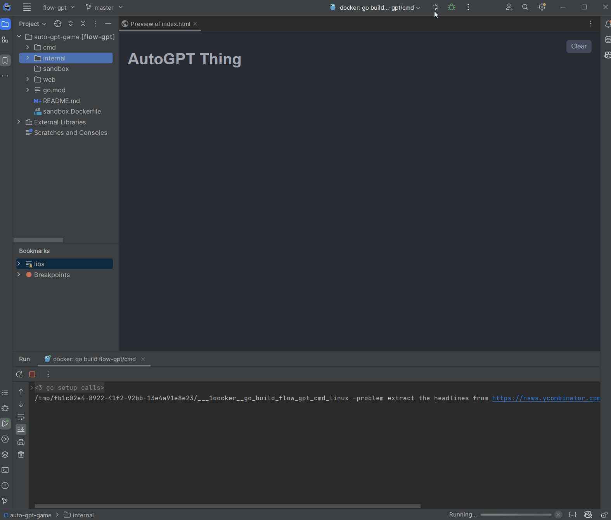

# FlowGPT

Another attempt at building an AutoGPT-like thing.

Instead of using the common plan and task pattern, FlowGPT will attempt to maintain internal dialogue to determine the correct steps to solve a problem.

## Demo

## Design

FlowGPT uses a finite state machine to determine the next step in the overall workflow to solving a problem. It consists of three different internal components: thought, critique and action. Each component will maintain their own memory and prompts.

## Usage

Requires an OpenAI API key, Go, and Docker. 

It's recommended to run inside the [sandbox.Dockerfile](sandbox.Dockerfile) to prevent it from making changes to your workstation.